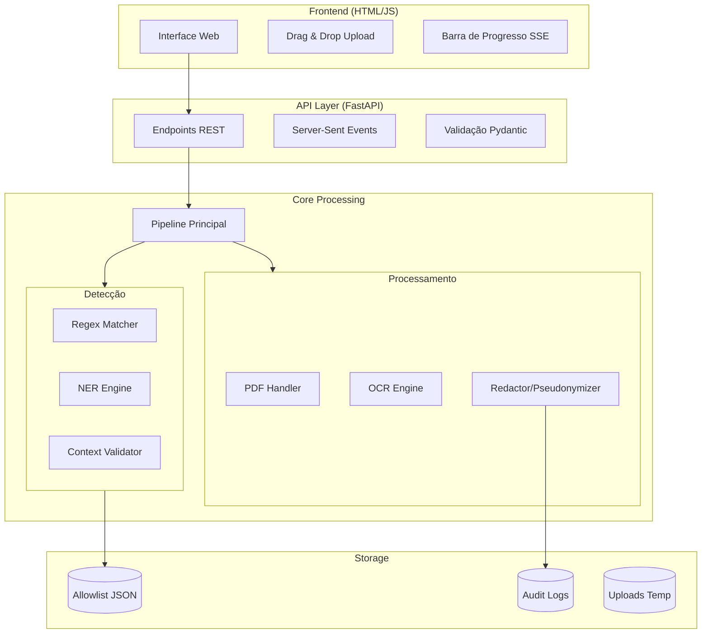
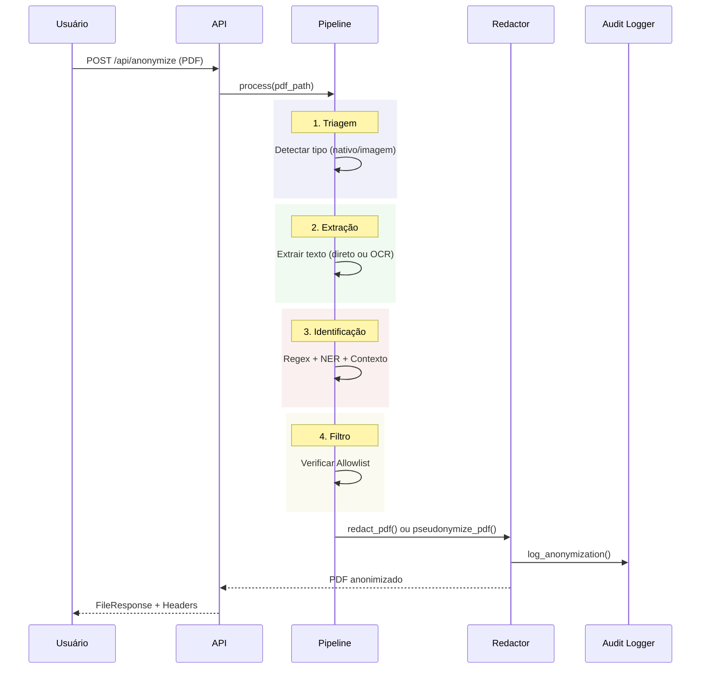

# TJMG Anonymizer - Documentação Técnica Completa

> **Sistema de Anonimização Automática de Documentos Judiciais**  
> Versão 2.0 | Fevereiro 2026

---

## 📋 Índice

1. [Visão Geral](#1-visão-geral)
2. [Arquitetura do Sistema](#2-arquitetura-do-sistema)
3. [Stack Tecnológica](#3-stack-tecnológica)
4. [Funcionalidades](#4-funcionalidades)
5. [Instalação e Configuração](#5-instalação-e-configuração)
6. [API Reference](#6-api-reference)
7. [Segurança e Compliance](#7-segurança-e-compliance)
8. [Monitoramento e Auditoria](#8-monitoramento-e-auditoria)
9. [Deploy em Produção](#9-deploy-em-produção)
10. [Troubleshooting](#10-troubleshooting)

---

## 1. Visão Geral

### 1.1 Objetivo

O **TJMG Anonymizer** é uma ferramenta de anonimização automática de documentos judiciais que identifica e protege dados sensíveis em conformidade com:

- **LGPD** (Lei Geral de Proteção de Dados) - Lei nº 13.709/2018
- **Resolução CNJ nº 615/2024** - Dispõe sobre dados em processos judiciais
- **Resolução TJMG nº 878/2019** - Publicidade processual eletrônica

### 1.2 Principais Capacidades

| Capacidade | Descrição |
|------------|-----------|
| **Detecção Automática** | Identifica CPF, CNPJ, nomes, endereços, telefones, e-mails, OAB |
| **Análise Contextual** | Diferencia partes (anonimizar) de autoridades (manter visíveis) |
| **Múltiplos Modos** | Tarjas pretas irreversíveis ou pseudonimização consistente |
| **OCR Integrado** | Processa documentos escaneados (PDFs imagem) |
| **Auditoria Completa** | Log imutável com hashes SHA-256 |
| **Upload até 200MB** | Suporta processos judiciais completos em PDF único |

### 1.3 Métricas de Performance

| Métrica | Valor |
|---------|-------|
| Precisão NER (SpaCy) | ~85% F1 |
| Precisão NER (BERTimbau) | ~95% F1 |
| Tempo médio por página | < 2 segundos |
| Tamanho máximo arquivo | 200 MB |
| Formatos suportados | PDF, DOCX |

---

## 2. Arquitetura do Sistema

### 2.1 Diagrama de Componentes



### 2.2 Fluxo de Processamento



---

## 3. Stack Tecnológica

### 3.1 Backend

| Componente | Tecnologia | Versão | Propósito |
|------------|------------|--------|-----------|
| Framework | FastAPI | 0.109.0 | API REST assíncrona |
| Server | Uvicorn | 0.27.0 | ASGI server |
| Validação | Pydantic | 2.5.3 | Schemas e validação |
| PDF | PyMuPDF | 1.23.8 | Manipulação de PDF |
| OCR | Tesseract | 0.3.10 | Extração de texto |
| OCR (Opcional) | PaddleOCR | 2.7.0 | OCR avançado |
| NLP | SpaCy | 3.7.2 | NER português |
| NLP (Opcional) | Transformers | 4.36.0 | BERTimbau NER |

### 3.2 Frontend

| Componente | Tecnologia | Propósito |
|------------|------------|-----------|
| Estrutura | HTML5 | Markup |
| Estilos | CSS3 (Vanilla) | UI/UX moderno |
| Lógica | JavaScript ES6+ | Interatividade |
| Progresso | Server-Sent Events | Real-time updates |

### 3.3 Infraestrutura

| Componente | Tecnologia | Propósito |
|------------|------------|-----------|
| Container | Docker | Empacotamento |
| Deploy | Railway/Docker Compose | Orquestração |
| Armazenamento | Filesystem | Logs e uploads |

---

## 4. Funcionalidades

### 4.1 Tipos de Dados Detectados

| Tipo | Método | Regex/Modelo |
|------|--------|--------------|
| **CPF** | Regex | `\d{3}\.\d{3}\.\d{3}-\d{2}` |
| **CNPJ** | Regex | `\d{2}\.\d{3}\.\d{3}/\d{4}-\d{2}` |
| **OAB** | Regex | `OAB[/-]?[A-Z]{2}[/-]?\d+` |
| **Telefone** | Regex | `\(\d{2}\)\s?\d{4,5}-\d{4}` |
| **E-mail** | Regex | `[\w.-]+@[\w.-]+\.\w+` |
| **CEP** | Regex | `\d{5}-\d{3}` |
| **Data** | Regex | `\d{2}/\d{2}/\d{4}` |
| **Pessoa** | NER | SpaCy/BERTimbau |
| **Endereço** | NER | SpaCy/BERTimbau |
| **Organização** | NER | SpaCy/BERTimbau |

### 4.2 Análise Contextual Bidirecional

O sistema analisa 60 caracteres **ANTES** e **DEPOIS** de cada nome identificado:

**Mantém visível (autoridades):**
- Juiz, Desembargador, Promotor, Defensor
- Dr., Dra., Exmo. Sr., MM. Juiz
- Seguido de OAB, matrícula, cargo

**Anonimiza (partes):**
- Autor, Réu, Requerente, Requerido
- Vítima, Testemunha, Agravante
- Seguido de "qualificado nos autos"

### 4.3 Modos de Anonimização

| Modo | Resultado | Caso de Uso |
|------|-----------|-------------|
| **Redact** | `CPF: ██████████████` | Documentos públicos |
| **Pseudonymize** | `CPF: 111.222.333-44` | Análises estatísticas |

### 4.4 Allowlist (Lista Branca)

Nomes que NÃO devem ser anonimizados:
- Magistrados conhecidos
- Promotores de justiça
- Defensores públicos
- Serventuários

```json
// data/allowlist/juizes.json
[
  {"nome": "João Carlos Mendes", "tipo": "juiz", "ativo": true}
]
```

---

## 5. Instalação e Configuração

### 5.1 Requisitos de Sistema

| Requisito | Mínimo | Recomendado |
|-----------|--------|-------------|
| CPU | 2 cores | 4+ cores |
| RAM | 4 GB | 8+ GB |
| Disco | 10 GB | 50+ GB |
| Python | 3.10+ | 3.11+ |
| OS | Linux/macOS/Windows | Linux (Ubuntu 22.04) |

### 5.2 Dependências do Sistema

```bash
# Ubuntu/Debian
sudo apt update
sudo apt install -y \
    tesseract-ocr \
    tesseract-ocr-por \
    poppler-utils \
    libmagic1

# macOS
brew install tesseract tesseract-lang poppler libmagic
```

### 5.3 Instalação da Aplicação

```bash
# 1. Clonar repositório
git clone https://github.com/tjmg/anonimizacao.git
cd anonimizacao

# 2. Criar ambiente virtual
python -m venv .venv
source .venv/bin/activate  # Linux/macOS
# .venv\Scripts\activate   # Windows

# 3. Instalar dependências base
pip install -r requirements.txt

# 4. Baixar modelo SpaCy
python -m spacy download pt_core_news_lg

# 5. (Opcional) Instalar BERTimbau para NER avançado
pip install -r requirements-transformers.txt

# 6. (Opcional) Instalar PaddleOCR para OCR avançado
pip install -r requirements-paddle.txt
```

### 5.4 Configuração via Variáveis de Ambiente

| Variável | Padrão | Descrição |
|----------|--------|-----------|
| `TJMG_OCR_ENGINE` | `tesseract` | `tesseract` ou `paddle` |
| `TJMG_NER_ENGINE` | `spacy` | `spacy` ou `transformer` |
| `TJMG_ANONYMIZATION_MODE` | `redact` | `redact` ou `pseudonymize` |
| `TJMG_MAX_FILE_SIZE_MB` | `200` | Limite de upload em MB |
| `TJMG_OCR_DPI` | `300` | Resolução para OCR |
| `PORT` | `8000` | Porta do servidor |

### 5.5 Executar Localmente

```bash
# Desenvolvimento
uvicorn app.main:app --reload --host 0.0.0.0 --port 8000

# Produção
uvicorn app.main:app --host 0.0.0.0 --port 8000 --workers 4
```

---

## 6. API Reference

### 6.1 Endpoints Principais

#### POST /api/analyze
Analisa documento sem anonimizar (preview).

**Request:**
```bash
curl -X POST http://localhost:8000/api/analyze \
  -F "file=@documento.pdf"
```

**Response:**
```json
{
  "job_id": "550e8400-e29b-41d4-a716-446655440000",
  "arquivo": "documento.pdf",
  "total_paginas": 15,
  "tipo_pdf": "nativo",
  "dados_sensiveis": [
    {
      "tipo": "CPF",
      "valor": "123.456.789-00",
      "pagina": 1,
      "posicao": {"x": 100, "y": 200, "width": 80, "height": 12},
      "confianca": 1.0
    }
  ],
  "total_identificados": 42,
  "tempo_processamento_ms": 1523
}
```

#### POST /api/anonymize
Anonimiza documento e retorna PDF.

**Request:**
```bash
curl -X POST http://localhost:8000/api/anonymize \
  -F "file=@documento.pdf" \
  -F "mode=pseudonymize" \
  -o documento_anonimizado.pdf
```

**Response Headers:**
```
X-Job-ID: 550e8400-e29b-41d4-a716-446655440000
X-Total-Redactions: 42
X-Original-Hash: sha256:abc123...
X-Anonymized-Hash: sha256:def456...
X-Processing-Time-Ms: 3250
X-Anonymization-Mode: pseudonymize
```

#### GET /api/progress/{job_id}
Stream de progresso em tempo real (SSE).

```javascript
const evtSource = new EventSource('/api/progress/job-id');
evtSource.onmessage = (e) => {
  const data = JSON.parse(e.data);
  console.log(`Página ${data.pagina_atual}/${data.total_paginas}`);
};
```

#### GET /api/audit/{job_id}
Recupera log de auditoria de um job.

#### GET /api/allowlist
Lista todos os itens na lista branca.

#### POST /api/allowlist
Adiciona item à lista branca.

---

## 7. Segurança e Compliance

### 7.1 LGPD Compliance

| Requisito LGPD | Implementação |
|----------------|---------------|
| Art. 5º, XI (Anonimização) | Remoção irreversível via PyMuPDF |
| Art. 6º, I (Finalidade) | Logs de auditoria registram propósito |
| Art. 6º, VII (Segurança) | SHA-256, metadados removidos |
| Art. 46 (Medidas de Segurança) | Container non-root, input sanitization |

### 7.2 Resolução CNJ 615/2024

| Requisito | Implementação |
|-----------|---------------|
| Art. 4º (Dados sensíveis) | CPF, nomes, endereços detectados |
| Art. 8º (Rastreabilidade) | Job ID + logs imutáveis |
| Art. 12º (Integridade) | Hashes SHA-256 antes/depois |

### 7.3 Medidas de Segurança

```
┌─────────────────────────────────────────────────────┐
│                  CAMADAS DE SEGURANÇA               │
├─────────────────────────────────────────────────────┤
│ 1. Validação de Input (Pydantic)                    │
│    - Tipos de arquivo permitidos                    │
│    - Limite de tamanho (200MB)                      │
│    - Sanitização de nomes de arquivo                │
├─────────────────────────────────────────────────────┤
│ 2. Processamento Seguro                             │
│    - Execução como usuário não-root                 │
│    - Diretórios temporários isolados                │
│    - Timeout de operações                           │
├─────────────────────────────────────────────────────┤
│ 3. Anonimização Irreversível                        │
│    - True Redaction (remove bytes)                  │
│    - Metadata scrubbing                             │
│    - Garbage collection no PDF                      │
├─────────────────────────────────────────────────────┤
│ 4. Auditoria                                        │
│    - Logs imutáveis (append-only)                   │
│    - Hashes encadeados                              │
│    - Timestamps UTC                                 │
└─────────────────────────────────────────────────────┘
```

---

## 8. Monitoramento e Auditoria

### 8.1 Estrutura dos Logs

```
logs/
├── audit/
│   ├── 2026-02-03.jsonl      # Logs do dia
│   └── 2026-02-02.jsonl
└── app.log                    # Logs da aplicação
```

### 8.2 Formato do Log de Auditoria

```json
{
  "timestamp": "2026-02-03T09:00:00.000Z",
  "job_id": "550e8400-e29b-41d4-a716-446655440000",
  "acao": "ANONIMIZACAO",
  "arquivo_original": {
    "nome": "processo_12345.pdf",
    "hash": "sha256:abc123...",
    "tamanho_bytes": 5242880
  },
  "arquivo_anonimizado": {
    "nome": "processo_12345_anonimizado.pdf",
    "hash": "sha256:def456..."
  },
  "dados_anonimizados": [
    {"tipo": "CPF", "valor": "123***"},
    {"tipo": "PESSOA", "valor": "Joa***"}
  ],
  "total_redacoes": 42,
  "tempo_processamento_ms": 3250,
  "ip_origem": "192.168.1.100"
}
```

### 8.3 Verificação de Integridade

```bash
# Verificar se arquivo foi processado pelo sistema
curl http://localhost:8000/api/audit/verify \
  -F "file=@documento_anonimizado.pdf"

# Response
{
  "verificado": true,
  "job_id": "550e8400-e29b-41d4-a716-446655440000",
  "data_processamento": "2026-02-03T09:00:00Z",
  "hash_confere": true
}
```

---

## 9. Deploy em Produção

### 9.1 Docker

```dockerfile
# Dockerfile já incluído no projeto
docker build -t tjmg-anonymizer .
docker run -p 8000:8000 \
  -e TJMG_NER_ENGINE=transformer \
  -e TJMG_MAX_FILE_SIZE_MB=200 \
  -v $(pwd)/data:/app/data \
  -v $(pwd)/logs:/app/logs \
  tjmg-anonymizer
```

### 9.2 Docker Compose

```yaml
version: '3.8'

services:
  anonymizer:
    build: .
    ports:
      - "8000:8000"
    environment:
      - TJMG_NER_ENGINE=spacy
      - TJMG_OCR_ENGINE=tesseract
      - TJMG_ANONYMIZATION_MODE=redact
      - TJMG_MAX_FILE_SIZE_MB=200
    volumes:
      - ./data:/app/data
      - ./logs:/app/logs
    restart: unless-stopped
    deploy:
      resources:
        limits:
          memory: 4G
        reservations:
          memory: 2G
```

### 9.3 Railway

```bash
# railway.json já configurado
railway up
```

Variáveis necessárias no Railway:
- `PORT` (injetado automaticamente)
- `TJMG_*` conforme necessário

### 9.4 Health Check

```bash
curl http://localhost:8000/health
# {"status": "ok", "timestamp": "2026-02-03T09:00:00Z"}
```

---

## 10. Troubleshooting

### 10.1 Problemas Comuns

| Problema | Causa | Solução |
|----------|-------|---------|
| OCR lento | PDF grande | Reduzir DPI ou usar PaddleOCR |
| Memória alta | BERTimbau carregado | Usar SpaCy ou aumentar RAM |
| Upload falha | Arquivo > limite | Aumentar `MAX_FILE_SIZE_MB` |
| NER impreciso | Modelo genérico | Usar `transformer` engine |
| Juiz anonimizado | Não está na allowlist | Adicionar à allowlist |

### 10.2 Logs de Debug

```bash
# Ativar logs detalhados
export TJMG_LOG_LEVEL=DEBUG
uvicorn app.main:app --reload
```

### 10.3 Verificar Dependências

```bash
# Testar OCR
tesseract --version

# Testar SpaCy
python -c "import spacy; nlp = spacy.load('pt_core_news_lg'); print('OK')"

# Testar Transformers (opcional)
python -c "from transformers import pipeline; print('OK')"

# Testar PaddleOCR (opcional)
python -c "from paddleocr import PaddleOCR; print('OK')"
```

---

## 📊 Anexo: Comparativo de Engines

### NER Engines

| Engine | Precisão | Velocidade | RAM | Instalação |
|--------|----------|------------|-----|------------|
| SpaCy | ~85% F1 | Rápido | 500MB | Incluído |
| BERTimbau | ~95% F1 | Médio | 2GB | Opcional (500MB) |

### OCR Engines

| Engine | Qualidade | Velocidade | Layouts | Instalação |
|--------|-----------|------------|---------|------------|
| Tesseract | Boa | Rápido | Simples | Incluído |
| PaddleOCR | Excelente | Médio | Complexos | Opcional (500MB) |

---

## 📞 Contato e Suporte

- **Desenvolvedor:** Setor de Inovação - TJMG
- **Repositório:** `github.com/tjmg/anonimizacao`
- **Documentação Online:** `docs.tjmg.jus.br/anonymizer`

---

*Documento gerado em 03/02/2026*  
*Versão 2.0 - SOTA Edition*
